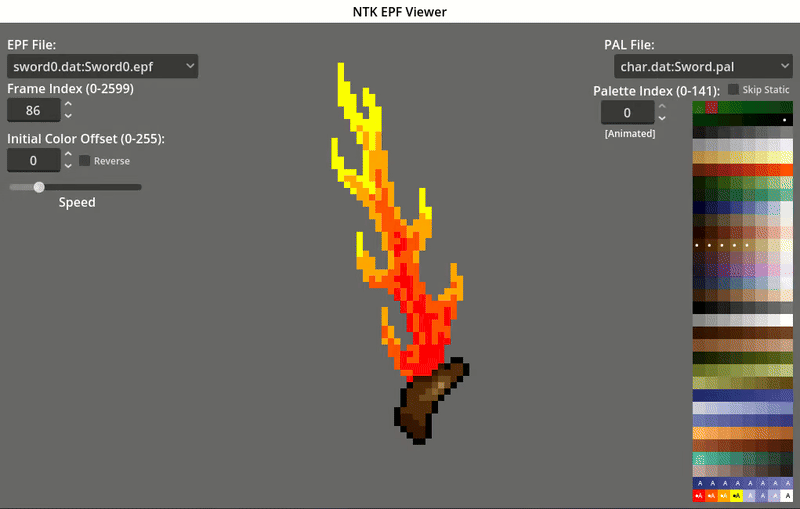

# EPFViewer

A [Godot](https://godotengine.org/) 4.x project to render EPFs w/
PALs from NexusTK DATs

## Setup / Usage

* Install NexusTK

* Import the `project.godot` file in Godot 4.x and Run the
application (F5) - the main scene is: `Apps/EPFViewer.tscn`

* If you don't have NexusTK in a predictable location, the program
won't start (see next step)

* `config.json.template` is copied to `config.json` (if
`config.json` does not exist) - Fill out this config to point to
your system's NexusTK directories

* Re-run the application (F5) and EPFViewer should hopefully launch
